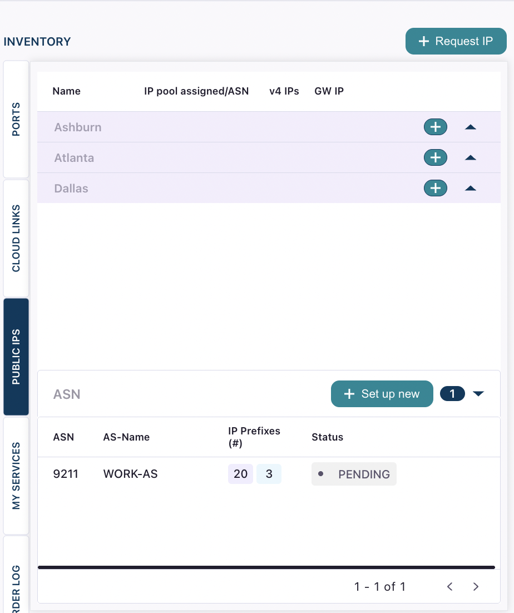

An Autonomous System Number (ASN) is a unique identifier assigned to your network that allows it to participate in Border Gateway Protocol (BGP) routing on the internet.

To use [DIA BGP](dia-overview#dia-bgp), you must submit your ASN in DynamicLink and have it approved before you can build a connection.

<Note>
  You only need to submit an ASN if you're using DIA BGP. Standard DIA connections do not require an ASN.
</Note>

<Tip>
  You can submit your ASN in advance for network planning—you don't need an active port or DIA BGP connection to submit one.
</Tip>

## Submit an ASN

Go to **Build Your Network \> Public IPs \> ASN**. Click **Set up new** and complete the following field:

| Field | Description |
| --- | --- |
| **ASN** | The public ASN assigned to your organization. |

Click **Setup**.

Your ASN will appear in the **ASN** section with a **Pending** status while Zayo reviews it.

## ASN approval

Zayo verifies that the submitted ASN belongs to your organization before approving it for use on the platform. Once verified, the status changes from **Pending** to **Approved** and displays in green.

If your ASN is declined, the reason for the decline will be shown in the **ASN** section. Common reasons include:

- The ASN is not registered to your organization
- The ASN is not publicly routable
- The ASN information does not match Zayo's records

You can submit a corrected ASN at any time by repeating the steps above.

## Use or delete an ASN

Once your ASN is approved, you can select it when [creating a DIA BGP connection](dia-bgp). A single approved ASN can be used across multiple DIA BGP connections.

<Note>
  Deleting an ASN is optional and should only be done if you no longer plan to use it for any DynamicLink service. If you delete an ASN and need it again later, you must submit it again and wait for re-approval.
</Note>

To delete an ASN, go to **Build Your Network \> Public IPs \> ASN**, locate the ASN, and click the trash icon.