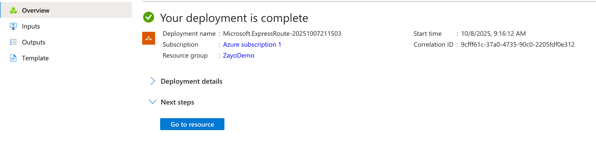
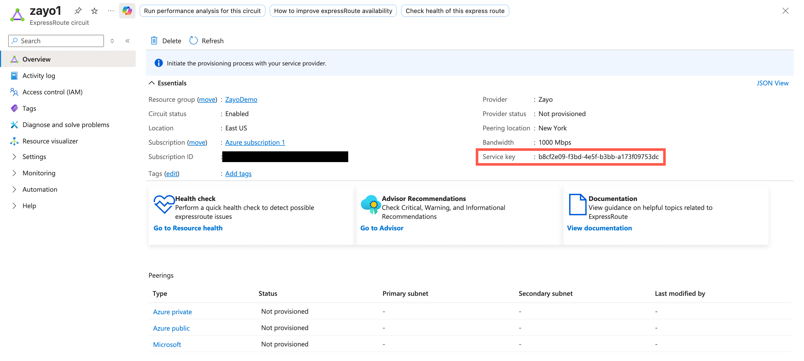

Azure ExpressRoute lets you create private connections between your on-premises infrastructure and Microsoft Azure services.

## Prerequisites

Before creating an Azure ExpressRoute connection, ensure you have:

- An active Azure subscription with appropriate permissions.
- A DynamicLink port with available bandwidth.

## Step 1: Create an ExpressRoute circuit in Azure

First, you need to create an ExpressRoute circuit in the Azure portal. This is required to obtain a service key, which you will then use to provision your connection in DynamicLink. 

Log in to the [Azure portal](https://portal.azure.com) and use the search bar at the top to find the **ExpressRoute circuits** page. 

Click **Create** and then complete the following fields:

**Configuration**

| Field | Description |
|------------|-----------------|
| **Subscription** | Your [subscription](https://learn.microsoft.com/en-us/azure/azure-resource-manager/management/azure-subscription-service-limits) is created at the account level and determines how you are billed.   |
| **Resource group** | A resource group acts like a folder that organizes related resources. You can use it to perform actions on multiple resources at once—for example, applying permissions, duplicating configurations, or deleting the entire group.   Each resource can belong to only one resource group, and each resource group is associated with a single subscription. |
| **Resiliency** | Select your resiliency type. For more information, see [Design and architect Azure ExpressRoute for resiliency](https://learn.microsoft.com/en-us/azure/expressroute/design-architecture-for-resiliency). |
| **Region** | Select the Azure region that you want to use. This region represents the availability zone or data center in which a resource is located.   This region does not need to match your Zayo peering location. For example, you may want to choose the same region as other resources within your selected resource group. |
| **Circuit name** | Enter a name for the circuit. |
| **Port type** | Select **Provider**. |
| **Peering location** | Choose from the available on-ramp locations provided by Zayo. |
| **Provider** | Select **Zayo DynamicLink**. |
| **Bandwidth** | Select your desired capacity. |
| **SKU** | Choose the appropriate [service tier](https://azure.microsoft.com/en-us/pricing/details/expressroute/). |
| **Billing model** | Select the correct billing option.   • **Metered:** Usage-based billing. • **Unlimited:** Fixed monthly rate. |

<Note>
The SKU and billing model apply only to Microsoft’s billing structure. Zayo billing is separate.
</Note>

**Monitoring**

Here you can enable monitoring rules to receive alerts when certain events occur, such as a drop in BGP availability or high bandwidth utilization. 

For more information, see [Monitor Azure ExpressRoute](https://learn.microsoft.com/en-us/azure/expressroute/monitor-expressroute). 

**Tags**

Here you can add tags as name/value pairs. These can help you organize and sort resources across groups. 

For more information, see [Use tags to organize your Azure resources and management hierarchy](https://learn.microsoft.com/en-us/azure/azure-resource-manager/management/tag-resources). 

**Review + create**

Confirm your selections and then click **Create**. 

It may take a few moments for your ExpressRoute resource to deploy. When it's complete, click **Go to resource**.

From your resource list, select the ExpressRoute circuit you just created. From here, you find and copy the **Service key**:

## Step 2: Create the connection in DynamicLink

Once you have your ExpressRoute service key from Azure, return to the DynamicLink portal.

Navigate to **Build Your Network > Ports**. Click **Add a Connection** in the upper right or click **Add connection** next to the port you are using. 

Complete the following fields:

**"A" Port**

Select **Customer Port** and then complete the following fields:

| Field | Description |
| --- | --- |
| **Port** | Select your source port. |
| **VLAN** | Enter an available VLAN. |
| **BW** | You can leave this blank. It will pre-populate when you enter your service key. |

**"Z" Port**

Select **Cloud Connection** and then select **Azure**. Complete the following fields:

| Field | Description |
| --- | --- |
| **Service Key** | Enter the service key you copied from the Azure portal. |
| **BW** | This is automatically populated with the bandwidth you selected when creating your ExpressRoute circuit. |
| **Peering Location** | This is automatically populated with the peering location you selected when creating your ExpressRoute circuit. |
| **Connection Type** | Select the [peering type](https://learn.microsoft.com/en-us/azure/expressroute/expressroute-circuit-peerings) you want to use:   • **Azure Private Peering:** For private virtual networks and Azure services. • **Microsoft Peering:** For accessing Microsoft services like Office 365 and Dynamics 365.    |
| **VLAN** | Enter a VLAN that is unique to this circuit. You will use this when configuring peering in the Azure portal. |

<Note>
You can configure both peering types if your use case requires access to both private Azure resources and Microsoft services.
</Note>

Enter a connection name and then click **Add**. 
 
## Step 3: Create a secondary connection (optional)

You can re-use your service key to create a secondary circuit connection. 

This is optional, but recommended. 

## Step 4: Set up peering

Return to the Azure portal and open your ExpressRoute circuit. From here you can finish setting up peering. 

See [Create and modify peering for an ExpressRoute circuit using the Azure portal](https://docs.azure.cn/en-us/expressroute/expressroute-howto-routing-portal-resource-manager).

