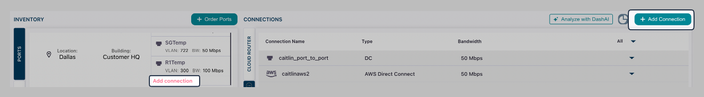
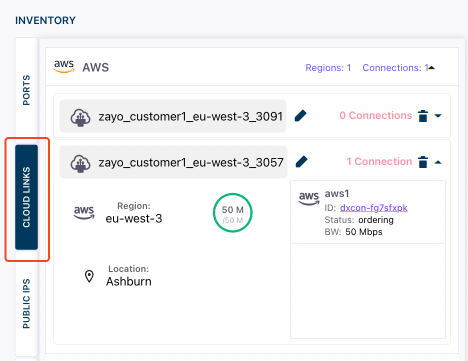
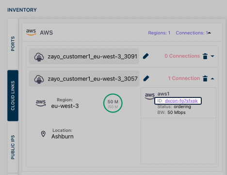
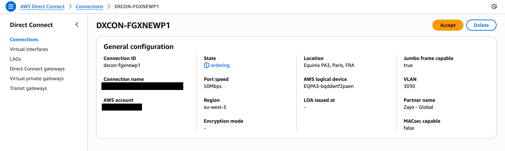
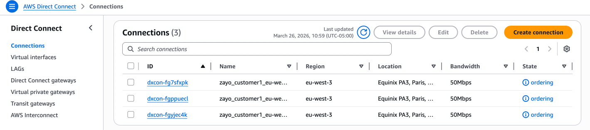

AWS Hosted Direct Connect gives you a private, dedicated network connection between your on-premises infrastructure and AWS, allowing you to bypass the public internet entirely. 

With DynamicLink, you create the connection in the DynamicLink portal and then accept it in the AWS console. 

<Note>
This guide covers creating a **Cloud Link** to AWS, which is a direct port-to-cloud connection. If you need to connect multiple clouds or sites together through a shared routing domain, see [Cloud Router to AWS](cloud-router-aws) instead.
</Note>

## Before you begin

Make sure you have the following ready before you start:

<Steps>
  <Step title="A DynamicLink port with available bandwidth">
    You need an existing port in DynamicLink to serve as the "A" side (your side) of the connection. If you don't have a port yet, see [Ports](ports) to get one set up. Your port must have enough unused bandwidth to support the cloud link you want to create — for example, if your port is 1 Gbps and you already have 800 Mbps in use, you can allocate up to 200 Mbps to this connection.
  </Step>
  <Step title="An active AWS account">
    You need an AWS account with permissions to work with Direct Connect. At minimum, your AWS IAM user or role needs the `directconnect:*` permissions (or the **AWSDirectConnectFullAccess** managed policy). If you're unsure whether you have the right permissions, check with your AWS administrator. See [Identity-based policy examples for Direct Connect](https://docs.aws.amazon.com/directconnect/latest/UserGuide/security_iam_id-based-policy-examples.html).
  </Step>
  <Step title="Your AWS account ID">
    This is the 12-digit number that identifies your AWS account. You can find it by clicking your account name in the upper-right corner of the AWS console. It's displayed in the dropdown menu and looks like `123456789012`.
  </Step>
</Steps>

## Step 1: Create the connection in DynamicLink

In this step, you'll configure both sides of the connection: the "A" side (your DynamicLink port) and the "Z" side (the AWS cloud endpoint).

1. In the DynamicLink portal, navigate to **Build Your Network**. 

2. Click **Add a Connection** in the upper right, or click **Add connection** next to the specific port you want to use.

    

### Configure the "A" port (your side)

The "A" port is the DynamicLink side of the connection. This is your physical port.

Select **Customer Port** as the connection type and complete the following fields:

| Field | What to enter |
| --- | --- |
| **Port** | Select the port you want to use as the starting point for this connection. If you only have one port, it will be pre-selected. |
| **VLAN** | Enter a VLAN ID (a number between 2 and 4094).   VLANs let you run multiple connections over a single physical port by tagging each one with a unique ID.  If this is your first connection on this port, you can use any number (e.g., `100`). If you already have connections, choose a number that isn't already in use. |
| **BW** | Select how much bandwidth to allocate to this connection. This must not exceed the available bandwidth on your port. If you're unsure, start with a smaller allocation. You can adjust this later. |

### Configure the "Z" port (AWS side)

The "Z" port is the cloud side of the connection. This is where AWS Direct Connect will terminate.

#### On-ramp selection

When you configure your Z port, you'll need to select an on-ramp (region and site). 

A “cloud on-ramp” is a colocation facility that houses edge devices from a cloud provider. In this case, it's a data center in which Zayo has already established a direct physical connection to AWS. 

When you select your region and on-ramp, consider where you are and where you want to go. 

For example, if you are located in Chicago (`us-east-2`) and you want to access an AWS-hosted resource in Seattle (`us-west-2`). 

**Option 1: Select an on-ramp location closest to where you are (`us-east-2`)**

-   Short access link, long WAN link
-   Traffic travels over the **AWS backbone** 
-   You pay AWS for that backbone transit

**Option 2: Select an on-ramp closest to your destination (`us-west-2`)**

-   Long WAN link via the DynamicLink backbone, then short hop into the site where you're accessing your data
-   You use DynamicLink's network instead of AWS's backbone for the long haul

#### Configure the Z port

Select **Cloud Connection**, then select **AWS**. Complete the following fields:

| Field | What to enter |
| --- | --- |
| **Region** | The AWS region either closest to you or where your cloud resources live (see [On-ramp selection](#on-ramp-selection) above for more details). |
| **Site Name** | After you select a region, a list of available on-ramps appears.  |
| **BW** | The bandwidth for the AWS side of the connection. This should be pre-filled with the bandwidth you selected when configuring the A side.  |
| **AWS Customer ID** | Your 12-digit AWS account ID (see [Before you begin](#before-you-begin) above for where to find this). |
| **Connection name** | A name for your connection in the DynamicLink portal.  In the AWS console, the connection name will have a unique ID and a name using the following pattern: `<DynamicLink_Tenant_Name>_<Region>_<NumericID>` |

Click **Add** to submit the connection request.

Click the **Cloud Links** tab on the right to see your connection:

<Note>
After you click **Add**, DynamicLink submits the connection request to AWS. The connection will appear on the **Cloud Links** page with an **Ordering** status. This is normal and it means AWS is processing the request. You may need to wait a few minutes before the connection is ready to accept from the AWS side.  
</Note>

## Step 2: Accept the connection in the AWS console

Once DynamicLink submits the connection, it appears in your AWS account as a pending hosted connection. You need to accept it before it becomes active.

You can navigate to the connection in two ways:

### Click the connection ID in DynamicLink

From **DynamicLink > Build Your Network**, select **Cloud Links** on the left. Find your connection and click the ID. This will open your AWS console Direct Connect page in a new tab. 

Click **Accept** in the upper right:

### Find the connection in the AWS console

You can also find your connection by navigating to it in AWS. 

Log in to the [AWS Management Console](https://console.aws.amazon.com/) and then use the search field to find the AWS Direct Connect page. 

<Warning>
If you don't see the connection, make sure you're looking in the correct AWS region. The region selector is in the upper-right corner of the AWS console. Switch to the region you selected when creating the connection in DynamicLink.
</Warning>

Once you have located the connection, click **Accept** in the upper right:

After acceptance, the connection status will progress through several states:

| Status | What it means |
| --- | --- |
| **Ordering** | The connection request has been submitted and is being processed. |
| **Pending** | AWS has received the request and is setting up the connection on their end. |
| **Available** | The connection is active and ready for you to create virtual interfaces. |

The transition from **Pending** to **Available** usually takes a few minutes.

## Step 3: Verify the connection in DynamicLink

After you accept the connection in AWS, return to DynamicLink to confirm everything is in sync.

1. Navigate to **Cloud Links** in the DynamicLink portal.
2. Locate your connection and check that the status has changed from **Ordering** to **Available** (or **Active**).

{/* SCREENSHOT: The Cloud Links page showing the connection with "Available" or "Active" status */}

<Tip>
If the status hasn't updated yet, wait a few minutes and refresh the page. The status update depends on AWS completing their side of the provisioning.
</Tip>

## Step 4: Create a virtual interface (VIF) in AWS

Your Direct Connect connection is now active, but it can't carry traffic yet. You need to create at least one **virtual interface (VIF)** to define how traffic flows between your network and AWS.

Think of the Direct Connect connection as a physical road and the VIF as the lane markings that direct traffic to the right destination.

### Choose the right VIF type

| VIF type | Use it when you need to... | Example |
| --- | --- | --- |
| **Private VIF** | Connect to resources inside a specific VPC (Virtual Private Cloud), such as EC2 instances, RDS databases, or internal load balancers. | You have a production VPC in `us-east-1` and want to access your servers over a private connection instead of the internet. |
| **Public VIF** | Access AWS public services (like S3, DynamoDB, or public API endpoints) over your Direct Connect link instead of the internet. | You want to transfer large files to S3 at high speed without going over the public internet. |
| **Transit VIF** | Connect to an AWS Transit Gateway (TGW), which lets you reach multiple VPCs and on-premises networks through a single connection. | You have several VPCs across multiple accounts and want to reach all of them through one Direct Connect connection. |

<Note>
If you're not sure which type to use: most users start with a **Private VIF** to connect to a single VPC. You can always add more VIFs later.
</Note>

### Create the VIF in AWS

1. In the AWS Direct Connect console, click **Virtual Interfaces** in the left sidebar.
2. Click **Create virtual interface**.
3. Select the type of VIF you need and fill in the required fields (such as the VLAN ID, BGP ASN, and the VPC or gateway you want to connect to).

For detailed instructions on each VIF type, see the AWS documentation: [Create a virtual interface](https://docs.aws.amazon.com/directconnect/latest/UserGuide/create-vif.html).

{/* SCREENSHOT: AWS Direct Connect Virtual Interfaces page with the "Create virtual interface" button */}

<Tip>
You can create multiple VIFs on a single Direct Connect connection. For example, you might have a Private VIF for your production VPC and a Public VIF for accessing S3 — both running over the same connection.
</Tip>

## Troubleshooting

### Connection stuck in "Ordering" status

If your connection stays in **Ordering** status for more than 10 minutes:

- Verify that the AWS account ID you entered in DynamicLink is correct (a common mistake is transposing digits).
- Make sure you're checking the correct AWS region in the AWS console.
- If the issue persists, contact [Zayo support](https://www.zayo.com/support/).

### Connection not visible in AWS console

- Double-check that you're in the correct AWS region. The region selector is in the upper-right corner of the AWS console.
- Verify that you're logged into the AWS account that matches the account ID you provided in DynamicLink.
- Ensure your IAM user/role has permissions for AWS Direct Connect.

### Connection shows "Down" after acceptance

- The connection may still be provisioning on the AWS side. Wait 5–10 minutes and check again.
- If it remains down, verify that the DynamicLink port is active and that the VLAN configuration is correct.

### VIF won't come up

- Confirm that the Direct Connect connection itself shows **Available** before creating a VIF.
- For Private VIFs, verify that the Virtual Private Gateway is attached to your VPC.
- For Transit VIFs, verify that the Transit Gateway is in the same region as your Direct Connect connection.
- Check that your BGP settings (ASN, authentication) match on both sides.
