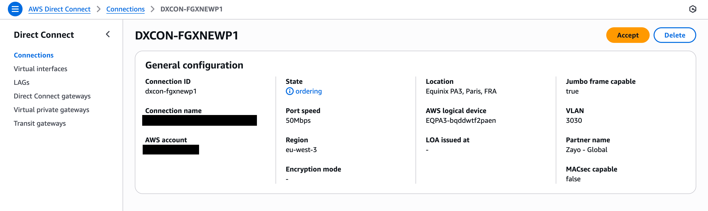

AWS Hosted Direct Connect provides a fast and cost-effective way to establish dedicated network connections to AWS. 

## Prerequisites

Before provisioning your AWS Hosted Direct Connect connection, ensure you have:

- An active AWS account with appropriate permissions
- A DynamicLink port with available bandwidth
- Your AWS account ID (12-digit number)

## Step 1: Create the connection in DynamicLink

Navigate to **Build Your Network > Ports** in the DynamicLink portal. Click **Add a Connection** in the upper right or click **Add connection** next to the port you are using. 

Complete the following fields:

**"A" Port**

Select **Customer Port** and then complete the following fields:

| Field | Description |
| --- | --- |
| **Port** | Select your source port. |
| **VLAN** | Enter an available VLAN. |
| **BW** | Select your desired bandwidth. |

**"Z" Port**

Select **Cloud Connection** and then select **AWS**. Complete the following fields:

| Field | Description |
| --- | --- |
| **Region** | Select the AWS region. To reduce latency, you should select the region closest to your A port. |
| **Site Name** | Select from a list of sites available in the region. |
| **BW** | Specify your desired bandwidth. |
| **AWS Customer ID** | Enter your AWS account ID (12-digit number).  |

Enter a name for the connection and then click **Add**. 

<Note>
The connection status will appear under on the **Cloud Links** page with the **Ordering** status. This indicates the request has been submitted to AWS for processing.
</Note>

## Step 2: Accept the connection in AWS console

Once the connection is created in DynamicLink, you need to accept it in your AWS account.

1. Log in to the [AWS Management Console](https://console.aws.amazon.com/directconnect/).
2. Go to the **AWS Direct Connect** service (you can find this by using the search bar at the top).
3. You should see your connection listed with your DynamicLink username. Select it. 
4.  Click **Accept** in the upper right. 

<Tip>
The connection acceptance process typically completes within a few minutes. You'll receive notifications when the status changes.
</Tip>

## Step 3: Configure virtual interfaces

After the connection is accepted, you need to create virtual interfaces (VIFs) to route traffic.

There are three types of VIFs:

* Private VIF for VPC connectivity
* Public VIF for AWS public services
* Transit VIF for connecting to an AWS Transit Gateway (TGW) 

For more information about creating a VIF, see [AWS Direct Connect virtual interfaces](https://docs.aws.amazon.com/directconnect/latest/UserGuide/create-vif.html).

<Tip>
You can create multiple VIFs on a single Direct Connect connection to connect to different VPCs or access different AWS services.
</Tip>

