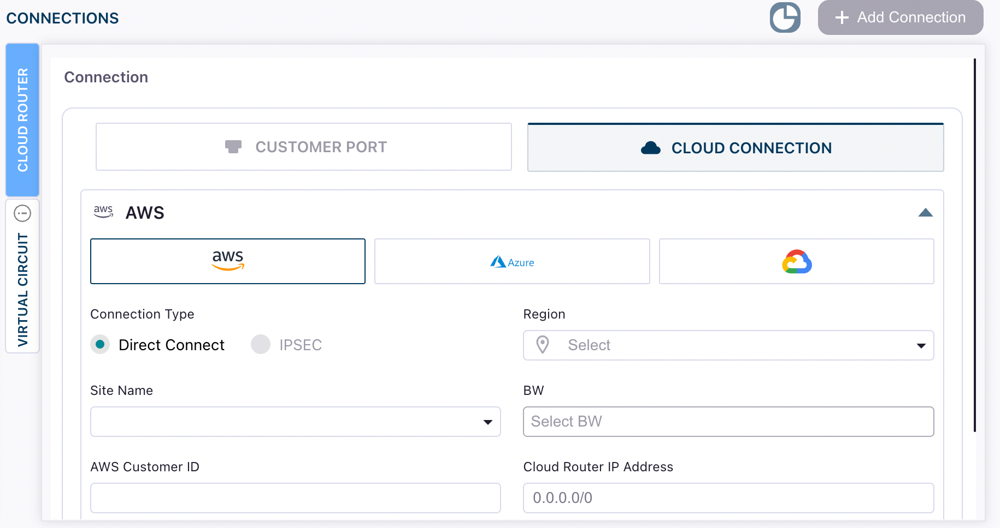
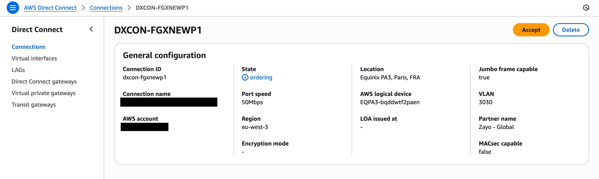

When attached to a Cloud Router, your AWS Hosted Direct Connect can be share a routing domain with other cloud links and virtual circuits. 

## Prerequisites

Before you begin, ensure you have:

- An active AWS account with permissions to accept Direct Connect connections
- A DynamicLink port with available bandwidth
- Your AWS account ID (12‑digit number)

## Step 1: Create the Cloud Router connection in DynamicLink

Navigate to **Build Your Network > Ports** in the DynamicLink portal. 

Under **Connections**, click the **Cloud Router** vertical tab.

Select **Cloud Connection** and then AWS:

Complete the following fields:

| Field | Description |
| --- | --- |
| **Connection Type** | At this time, we only support Direct Connect connections.  |
| **Region** | AWS region of your VPC (e.g., `us-east-1`). |
| **Site Name** | An available site for the chosen region. |
| **BW** | Desired bandwidth for the Direct Connect link. |
| **AWS Customer ID** | Your AWS account ID (12 digits). |
| **Cloud Router IP Address** | The IP address that the Cloud Router will use for BGP peering with AWS. This is typically the customer-side IP address in a `/30` subnet. When creating your Virtual Interface in AWS, you'll specify both the AWS-side and customer-side IP addresses for the BGP session. |

Enter a name for the connection and then click **Add**. 

## Step 2: Accept the connection in AWS

1. Log in to the AWS Management Console and open **AWS Direct Connect**.
2. Locate the new connection (it will reference your DynamicLink account/username).
3. Select the connection and click **Accept**.

<Tip>
After acceptance, statuses typically progress from **Ordering** to **Pending** and then to **Available** once AWS completes provisioning (usually a few minutes).
</Tip>

## Step 3: Create AWS virtual interfaces (VIFs)

After the physical connection is available, create one or more VIFs to carry traffic:

- Private VIF for VPC connectivity
- Public VIF for AWS public services
- Transit VIF for AWS Transit Gateway (TGW)

Refer to AWS docs: [AWS Direct Connect virtual interfaces](https://docs.aws.amazon.com/directconnect/latest/UserGuide/create-vif.html).

## Step 4: Verify in DynamicLink

Return to the Cloud Routers page and verify your connection appears as **Available**. 

## Next steps (routing)

Next, you will need to set up BGP and configure your Cloud Router ASN and peerings. 

