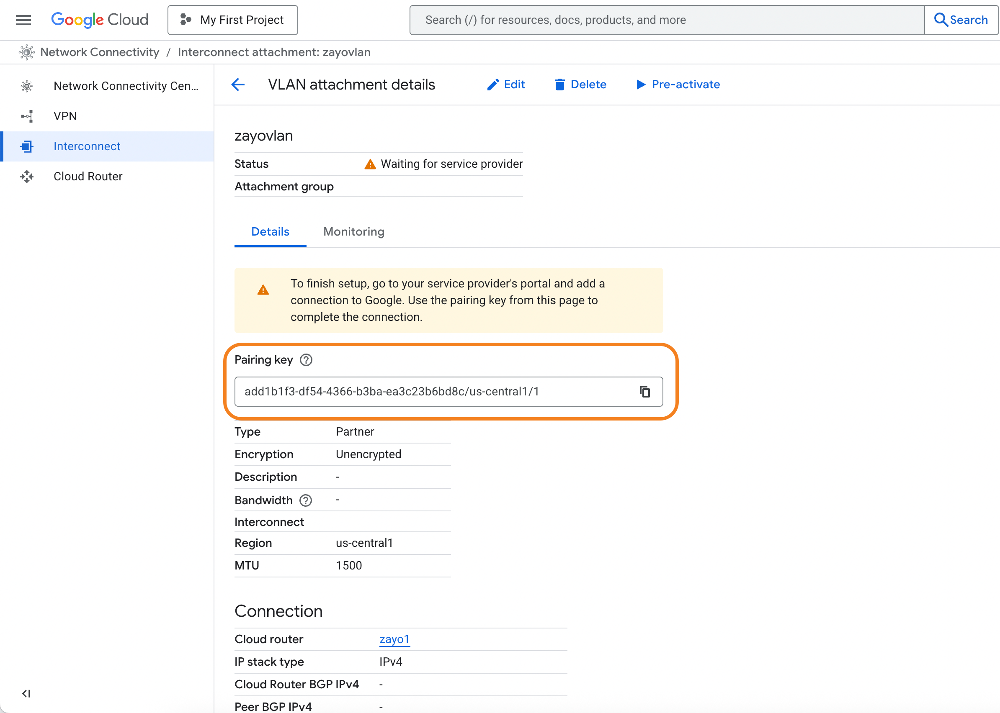

When attached to a Cloud Router, your Google Cloud Interconnect can share a routing domain with other cloud links and virtual circuits.

## Prerequisites

Before you begin, ensure you have:

- An active Google Cloud account with appropriate permissions
- [Compute Engine API](https://console.cloud.google.com/marketplace/product/google/compute.googleapis.com) enabled for your Google Cloud project
- A VPC in your Google Cloud environment. For more information, see [Google Cloud - Create and manage VPC networks](https://cloud.google.com/vpc/docs/create-modify-vpc-networks)
- A DynamicLink port with available bandwidth

## Step 1: Create a partner interconnect VLAN attachment in Google Cloud

In the search field at the top of Google Cloud Console home page, enter "Interconnect" and select the product page.

Go to the **Interconnect** page and click **Create VLAN attachments**.

There are two types of partner interconnect VLAN attachments:

* **Encrypted**: HA VPN over your connection. See [HA VPN over Cloud Interconnect overview](https://cloud.google.com/network-connectivity/docs/interconnect/concepts/ha-vpn-interconnect).

    Note that while this is supported on the Zayo NaaS platform, you will need to deploy and configure IPsec on-prem.
* **Unencrypted**: Unencrypted connections are still private and secure, but do not use VPN tunneling and do not require IPsec.

For instructions on provisioning a VLAN attachment, see [Create VLAN attachments](https://cloud.google.com/network-connectivity/docs/interconnect/how-to/partner/creating-vlan-attachments).

When creating your VLAN attachment, note the following:

| Field | Comments |
| --- | --- |
| **MTU** | Support for up to 9000 MTU |
| **IP stack type** | Select **IPv4 (single-stack)** (we do not support IPv6 at this time) |

After you provision your interconnect, you will be provided one pairing key for each VLAN attachment.

Copy this key as you will need to provide it when setting up the connection in DynamicLink.

## Step 2: Create the Cloud Router connection in DynamicLink

Once you have your pairing key from Google Cloud, return to the DynamicLink portal.

Navigate to **Build Your Network > Ports** in the DynamicLink portal.

Under **Connections**, click the **Cloud Router** vertical tab.

Select **Cloud Connection** and then Google:

Complete the following fields:

| Field | Description |
| --- | --- |
| **Pairing key 1** &nbsp;&nbsp;&nbsp;&nbsp;&nbsp;  **Pairing key 2** | Enter the pairing keys you copied from Google Cloud console after creating your VLAN attachment. |
| **Region** | This is automatically populated with the region you selected while provisioning the VLAN attachment. |
| **BW** | Desired bandwidth for the Google Cloud Interconnect link. |

Enter a name for the connection and then click **Add**.

## Step 3: Activate the connection in Google Cloud

Return to the Google Cloud Console and activate the connection. See [Activating connections](https://cloud.google.com/network-connectivity/docs/interconnect/how-to/partner/activating-connections).

<Tip>
After activation, statuses typically progress from **Pending** to **Available** once Google Cloud completes provisioning (usually a few minutes).
</Tip>

## Step 4: Verify in DynamicLink

Return to the Cloud Routers page and verify your connection appears as **Available**.

## Next steps (routing)

Next, you will need to set up BGP and configure your Cloud Router ASN and peerings.

