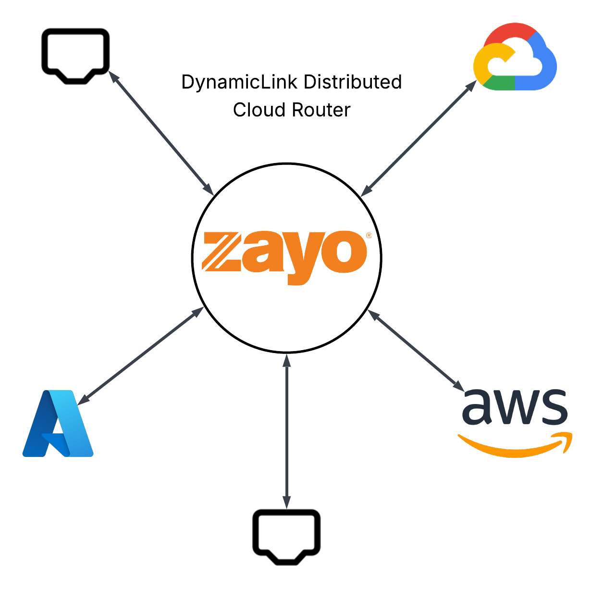

The Cloud Router is the virtual routing and switching core of your DynamicLink NaaS platform. It intelligently directs traffic between all your connected resources, including data center ports, cloud links, and internet connections, providing a centralized hub for managing complex network topologies.

You can use the Cloud Router to build your own network between data centers, cloud service providers, and DIA connections.

## How the Cloud Router works

The Cloud Router operates as a virtualized routing engine that:

1. Learns network topology from all connected resources and routing protocols.
2. Maintains routing tables with both static and dynamic routes.
3. Makes forwarding decisions based on destination IP addresses and routing policies.
4. Manages BGP sessions with external networks and cloud providers.
5. Implements security policies through integrated firewall and filtering capabilities.
