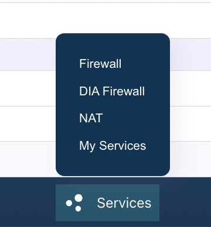
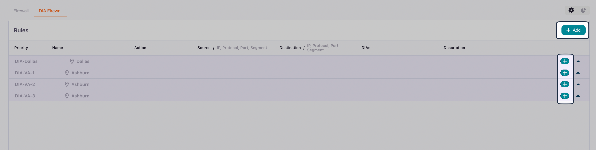

The DIA Firewall protects your internet connection by filtering traffic and controlling access to your network.

The DIA Firewall comes with a secure default policy:

- **Allow All outgoing**: All outbound traffic is allowed by default
- **Deny All incoming**: All inbound traffic is blocked by default

This default configuration ensures that your network can access the internet while protecting it from unauthorized external access. You can create custom rules to modify this behavior as needed.

## Prerequisites

Go to **Services \> My Services** and ensure the **DIA Firewall** and (optionally) **Web Filtering** services are enabled.

If you want to be able to apply rules to a pre-defined group of IP addresses, you should first create a [Group](group) to represent those subnets.

## Create a DIA Firewall rule

Select **Services \> DIA Firewall** from the bottom menu:

You will see a list of your DIA connections and any existing firewall rules.

There are two ways to add firewall rules:

- Click **Add** in the upper right to create rules that you want to apply to multiple DIA connections.
- Click the add icon next to a connection to create rules that are specific to that connection.

### General

| Field           | Description                                                                          |
| --------------- | ------------------------------------------------------------------------------------ |
| **Name**        | A descriptive name that identifies the rule's purpose                                |
| **Priority**    | Numerical priority value. Lower numbers have higher priority and are processed first |
| **Description** | (Optional) Additional details about the rule's purpose                               |

### Rule

Your options change slightly depending on whether you are creating a rule for an individual connection or for multiple connections.

Your options also change depending on whether you are creating a rule for **Incoming** traffic or **Outgoing** traffic.

#### Incoming rule

Select **Incoming** to create a rule for a traffic source (where the traffic originates before entering your network):

| Field                                           | Description                                                                                                                                                                  | Example                                   |
| ----------------------------------------------- | ---------------------------------------------------------------------------------------------------------------------------------------------------------------------------- | ----------------------------------------- |
| **IP protocol**                                 | Select `IPv4` or `IPv6`. Must match the IP version used in the **Source** field.   This field is only available when creating a rule for an individual connection. | `IPv4`                                    |
| **Protocol**                                    | Transport layer protocol                                                                                                                                                     | `TCP`, `UDP`, `ICMP`, or `Any`            |
| **Source Port**                                 | Source port number or range (optional)                                                                                                                                       | `1024-65535` or `22`                      |
| **Destination Port**                            | Destination port number or range (optional)                                                                                                                                  | `443` (HTTPS), `22` (SSH), `80` (HTTP)    |
| **Source**                                      | Enter a source IP prefix, select a [Group](groups), or select a pre-defined website (optional)                                                                               | `192.168.1.0/24` or `0.0.0.0/0` (all IPs) |
| **DIA IP Connections**  **DIA IP Address** | The DIA connection or connections to which this rule applies                                                                                                                 | -                                         |
| **Action**                                      | What to do when traffic matches this rule                                                                                                                                    | **Allow** (permit) or **Block** (deny)    |

#### Outgoing rule

Select **Outgoing** to create a rule for a traffic destination (where the traffic goes when leaving your network):

| Field                                           | Description                                                                                                                                                                       | Example                                   |
| ----------------------------------------------- | --------------------------------------------------------------------------------------------------------------------------------------------------------------------------------- | ----------------------------------------- |
| **IP protocol**                                 | Select `IPv4` or `IPv6`. Must match the IP version used in the **Destination** field.   This field is only available when creating a rule for an individual connection. | `IPv4`                                    |
| **Protocol**                                    | Transport layer protocol                                                                                                                                                          | `TCP`, `UDP`, `ICMP`, or `Any`            |
| **Source Port**                                 | Source port number or range (optional)                                                                                                                                            | `1024-65535` or `22`                      |
| **Destination Port**                            | Destination port number or range (optional)                                                                                                                                       | `443` (HTTPS), `22` (SSH), `80` (HTTP)    |
| **DIA IP Connections**  **DIA IP Address** | The DIA connection or connections to which this rule applies                                                                                                                      | -                                         |
| **Destination**                                 | Enter a destination IP prefix, select a [Group](groups), or select a pre-defined website (optional)                                                                               | `192.168.1.0/24` or `0.0.0.0/0` (all IPs) |
| **Action**                                      | What to do when traffic matches this rule                                                                                                                                         | **Allow** (permit) or **Block** (deny)    |

## Understanding rule processing

It's important to understand how firewall rules are processed:

- **Priority-based execution**: Rules are processed in order of priority, starting with the lowest number. The first rule that matches the traffic is applied
- **Logical AND condition**: All filters within a single rule (Source, Destination, Port, Protocol, etc.) are combined with a logical **AND**. This means all specified conditions must match for the rule to be triggered
- **First match wins**: Once a rule matches the traffic, its action is applied and no further rules are evaluated for that traffic

## Common use cases

### Allow inbound SSH access

To allow SSH access from a specific IP range:

1. **Name**: "Allow-SSH-From-Office"
2. **Priority**: `100`
3. **Direction**: `Incoming`
4. **Action**: **Allow**
5. **Protocol**: `TCP`
6. **Source**: `203.0.113.0/24` (your office IP range)
7. **Destination Port**: `22`
8. **DIA Connection**: Select your DIA connection

### Allow inbound web server traffic

To allow HTTP and HTTPS traffic to your web server:

1. **Name**: `Allow-Web-Traffic`
2. **Priority**: `100`
3. **Direction**: `Incoming`
4. **Action**:  **Allow**
5. **Protocol**: `TCP`
6. **Source**: `0.0.0.0/0` (all IPs) or a specific IP range
7. **Destination Port**: `80,443` (HTTP and HTTPS)
8. **DIA Connection**: Select your DIA connection

### Block outbound traffic to specific destinations

To prevent outbound connections to specific IP ranges:

1. **Name**: `Block-Outbound-Malicious-IPs`
2. **Priority**: `50` (higher priority to ensure it's checked first)
3. **Direction**: `Outgoing`
4. **Action**: `Block`
5. **Protocol**: `Any`
6. **Destination**: `192.0.2.0/24` (the IP range to block)
7. **DIA Connection**: Select your DIA connection

## Best Practices

1. **Start with restrictive rules**: Begin with the default deny-all-incoming policy and only open what you need
2. **Use descriptive names**: Name your rules clearly so you can understand their purpose later
3. **Set appropriate priorities**: Use lower priority numbers for more specific rules that should be checked first
4. **Document with descriptions**: Use the description field to explain why a rule exists
5. **Test incrementally**: Add rules one at a time and test to ensure they work as expected
6. **Regular review**: Periodically review your firewall rules to remove unused or outdated configurations
7. **Use IP Groups**: For frequently referenced IP ranges, create IP Groups to simplify rule management

## Troubleshooting

If your firewall rules aren't working as expected:

1. **Check rule priority**: Ensure your rule has an appropriate priority and isn't being overridden by another rule
2. **Verify direction**: Confirm you've set the correct direction (Incoming vs. Outgoing)
3. **Review all conditions**: Remember that all conditions in a rule must match (logical AND)
4. **Check Admin State**: Ensure the rule is enabled
5. **Verify DIA connection**: Confirm the rule is applied to the correct DIA connection
6. **Test with specific IPs**: Start with specific source/destination IPs before using broad ranges like `0.0.0.0/0`

## Related Documentation

- [DIA Overview](dia-overview) - Learn about Dedicated Internet Access
- [Create a DIA Connection](dia-create) - Set up a new DIA connection
- [Firewall Rules](firewall) - Stateful firewall configuration
- [Groups](groups) - Create IP Groups for firewall rule management