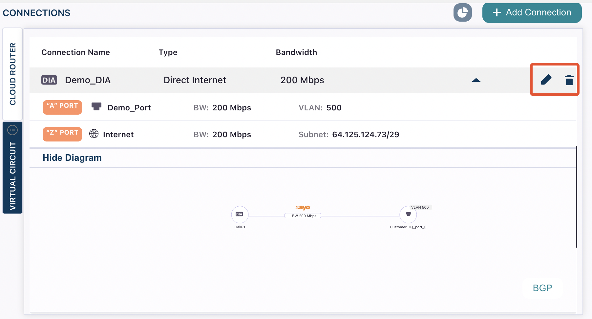

Once a DIA connection is created, you can do the following:

* Delete the connection
* Edit the connection to increase or decrease the bandwidth
* Set up DIA firewall rules

## Update connection speed

Go to **Build Your Network** and find your DIA connection. Hover over the name and select the edit icon. 

From here you can use the bandwidth (**BW**) drop-down menu next to the port to increase or decrease the bandwidth (speed). 

## Delete the connection

Go to **Build Your Network** and find your DIA connection. Hover over the name and select the delete icon. 

Note that deleting your DIA connection does not delete your [public IP pool](public-ips). 

<Tip>
You can also use [InsideIQ](ask-ai) to update your connections. 

For example, "Increase the speed of Demo_DIA to 300 Mbps" or "Delete Demo_DIA"
</Tip>