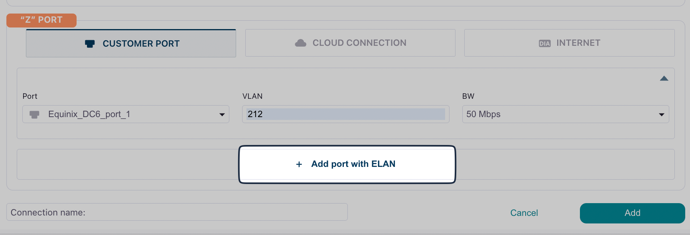

ELAN (Ethernet LAN) services provide multi-point Layer 2 connectivity, allowing you to connect multiple endpoints (ports) in a single network segment. 

Unlike E-Line connections which connect exactly two endpoints, ELAN enables any-to-any communication between all connected sites.

## Prerequisites

Before creating an ELAN connection, ensure you have:

- Three or more provisioned ports in DynamicLink (one for each endpoint you want to connect)
- Sufficient available bandwidth on all ports
- An understanding of which VLANs are available on each port
- A clear network design for your multi-point topology

## Create an ELAN connection

Navigate to **Build Your Network > Ports**. Click **Add a Connection** in the upper right or click **Add connection** next to the port you are using. 

Complete the following fields:

**"A" Port**

Select **Customer Port** and then complete the following fields:

| Field | Description |
| --- | --- |
| **Port** | Select your source port. |
| **VLAN** | Enter an available VLAN. This VLAN will be used across all endpoints in the ELAN. |
| **BW** | Select your desired bandwidth. This bandwidth will be allocated for this connection on each port. |

**"Z" Port**

Select **Customer Port** and then complete the fields as described above. 

To continue adding ports in your ELAN connection, click **Add port with ELAN** at the bottom. 

## Best practices

When creating E-Line connections, consider the following:

- **Naming Convention**: Use clear, descriptive names that include location identifiers (e.g., "NYC-DC1-to-CHI-DC2")
- **Bandwidth**: Size your bandwidth based on expected traffic patterns and peak usage
- **Redundancy**: For critical connections, consider creating redundant E-Line services on separate ports for high availability