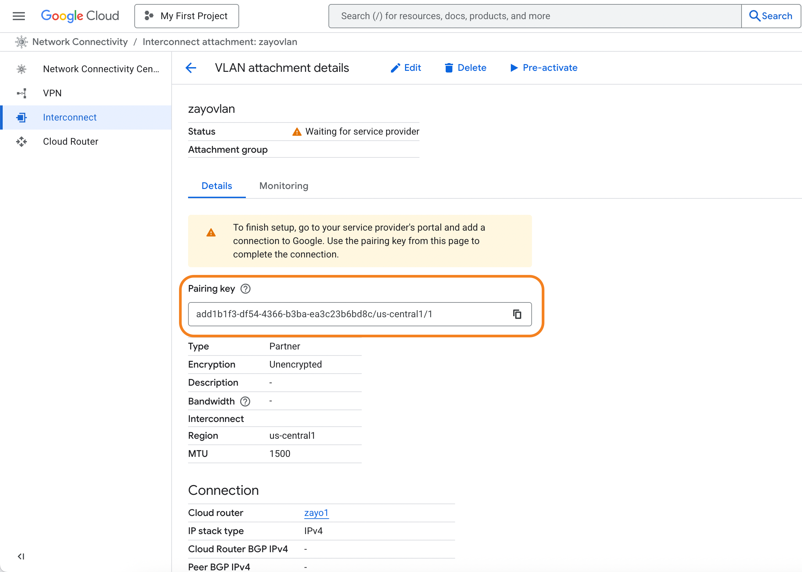

Google Cloud Interconnect enables you to create private connections between your on-premises infrastructure and Google Cloud Platform services. 

## Prerequisites

Before creating a Google Cloud Interconnect connection, ensure you have:

- An active Google Cloud account with appropriate permissions.
- [Compute Engine API](https://console.cloud.google.com/marketplace/product/google/compute.googleapis.com) enabled for your Google Cloud project. 
- A VPC in your Google Cloud environment. For more information, see [Google Cloud - Create and manage VPC networks](https://cloud.google.com/vpc/docs/create-modify-vpc-networks).
- A DynamicLink port with available bandwidth.

## Step 1: Create a partner interconnect VLAN attachment in Google Cloud

In the search field at the top of Google Cloud Console home page, enter "Interconnect" and select the product page. 

Go to the **Interconnect** page and click **Create VLAN attachments**. 

There are two types of partner interconnect VLAN attachments:

* **Encrypted**: HA VPN over your connection. See [HA VPN over Cloud Interconnect overview](https://cloud.google.com/network-connectivity/docs/interconnect/concepts/ha-vpn-interconnect).

    Note that while this is supported on the Zayo NaaS platform, you will need to deploy and configure IPsec on-prem. 
* **Unencrypted**: Unencrypted connections are still private and secure, but do not use  VPN tunneling and do not require IPsec. 

For instructions on provisioning a VLAN attachment, see [Create VLAN attachments](https://cloud.google.com/network-connectivity/docs/interconnect/how-to/partner/creating-vlan-attachments). 

When creating your VLAN attachment, note the following:

| Field | Comments |
| --- | --- |
| **MTU** | Support for up to 9000 MTU |
| **IP stack type** | Select **IPv4 (single-stack)** (we do not support IPv6 at this time) |

After you provision your interconnect, you will be provided a pairing key for each VLAN attachment. 

Copy this key as you will need to provide it when setting up the connection in DynamicLink. 

## Step 2: Create the connection in DynamicLink

Once you have your pairing key from Google Cloud, return to the DynamicLink portal.

Navigate to **Build Your Network > Ports**. Click **Add a Connection** in the upper right or click **Add connection** next to the port you are using. 

Complete the following fields:

**"A" Port**

Select **Customer Port** and then complete the following fields:

| Field | Description |
| --- | --- |
| **Port** | Select your source port. |
| **VLAN** | Enter an available VLAN. |
| **BW** | Select the bandwidth you'd like to allocate for this connection. |

**"Z" Port**

Select **Cloud Connection** and then select **Google**. Complete the following fields:

| Field | Description |
| --- | --- |
| **Pairing key 1** &nbsp;&nbsp;&nbsp;&nbsp;&nbsp;  **Pairing key 2** | Enter the pairing keys you copied from Google Cloud console after creating your VLAN attachment. |
| **Region** | This is automatically populated with the region you selected while provisioning the VLAN attachment. |
| **BW** | Select the same bandwidth you selected for your source port above. |

Enter a connection name and then click **Add**. 

## Activate the connection

Return to the Google Cloud Console and activate the connection. See [Activating connections](https://cloud.google.com/network-connectivity/docs/interconnect/how-to/partner/activating-connections).

