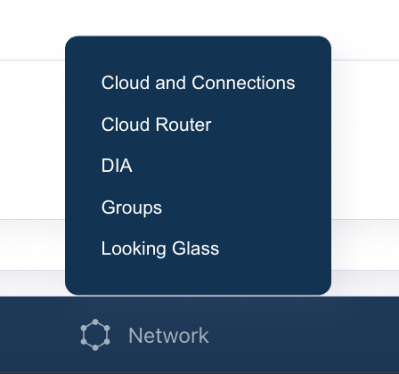

Groups allow you to organize multiple IP subnets into a single entity that can then be referenced elsewhere within DynamicLink.

For example:

- Office IP ranges for firewall rules
- Server subnets for access control
- Cloud provider IP ranges
- Trusted network segments

## Add a Group

Select **Network** in the bottom menu and then select **Groups**.  

From here you can add and update Groups.

1. Click **Add** in the upper right. 
2. Provide a name for the Group. 
3. Next to **Add IP Subnet**, enter the subnet you want to include in the grou. 

