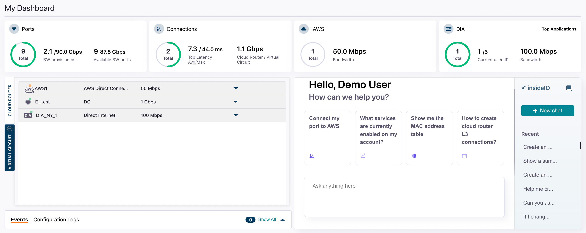

InsideIQ is an intelligent, conversational assistant integrated directly into the DynamicLink portal. InsideIQ is designed to streamline your workflow, provide instant support, and give you unprecedented control over your network resources using simple, natural language.

## Access InsideIQ

From anywhere in the app, click the InsideIQ icon in the bottom right:

From the dashboard, you can see common questions and create a new chat:

## Context and RAG

InsideIQ uses Retrieval-Augmented Generation (RAG). 

Retrieval-Augmented Generation (RAG) is an AI technique that combines a retrieval system with a generative model. 

Instead of relying only on what an external model was trained on, InsideIQ first searches the Zayo DynamicLink knowledge base. That retrieved context is then passed into the InsideIQ LLM so its answer is grounded in current, specific, and domain-accurate data. 

This reduces hallucinations and lets models handle topics they weren’t originally trained on.

## Use InsideIQ as a question and support bot

You can use the InsideIQ LLM as a support bot where you can ask troubleshooting questions, how-to questions, and any other questions about DynamicLink processes or concepts. 

For example: 

- "My latency to the AWS us-east-1 on-ramp seems high. What are the first steps to investigate?"
- "How do I add a new VLAN to my existing port?"
- "What is the difference between an E-Line and an E-LAN service?"

InsideIQ will analyze your question, retrieve the relevant information from the knowledge base, and provide a synthesized, easy-to-understand answer directly in the chat window.

## Use InsideIQ as an operational tool

You can perform **CRUD (Create, Read, Update, Delete)** operations on your network resources simply by telling InsideIQ what you want to do.

This feature applies to a wide range of your DynamicLink resources, including:

- L2 & L3 Connections (E-Line, E-LAN, etc.)
- Dedicated Internet Access (DIA)
- Cloud Connections (AWS, Azure, Google Cloud, etc.)
- Service Events & Alarms
- Performance Statistics
- Enable /Disable Services
- Set Security rules

<Note>

You will **always be presented with a confirmation prompt** before execution. See [Command verification](#command-verification) below

</Note>

### Command structure and best practices

- **Be specific**: Include identifiers like circuit IDs, locations, or service names for clarity.
- **State your intent clearly**: Use action words like "create," "show," "get," "update," "change," "increase," or "delete."
- **Combine queries**: You can ask for information and then act on it in a subsequent command.

### Example CRUD commands

The following table provides examples of how you can manage your resources using natural language.

| Intent / Action | Resource         | Example Command                                                                             | Expected Outcome                                                                                                           |
| :-------------- | :--------------- | :------------------------------------------------------------------------------------------ | :------------------------------------------------------------------------------------------------------------------------- |
| **Create (C)**  | L2 Connection    | "Create a new 1 Gbps E-Line service between our port in Chicago and our port in New York."  | InsideIQ initiates the provisioning workflow and prompts you for any additional required details.                          |
| **Create (C)**  | Cloud Connection | "Provision a new 500 Mbps connection to AWS in us-east-1 using my existing port."           | InsideIQ begins the cloud on-ramp provisioning process.                                                                    |
| **Read (R)**    | Statistics       | "Show me the bandwidth utilization stats for circuit ID `ZYO-12345` for the last 24 hours." | InsideIQ displays a chart or summary of the requested statistics directly in the chat.                                     |
| **Read (R)**    | Events / Alarms  | "Are there any active alarms on my DIA service in London?"                                  | InsideIQ queries the event management system and reports the status of any relevant alarms.                                |
| **Read (R)**    | Service Details  | "Get the configuration details for my Azure ExpressRoute connection `ER-ASH-01`."           | InsideIQ returns key configuration data like VLAN IDs, peer IPs, and service keys.                                         |
| **Update (U)**  | Bandwidth        | "Increase the bandwidth of circuit `ZYO-54321` to 2 Gbps."                                  | InsideIQ presents a summary of the change and the associated cost, then asks for confirmation to proceed.                  |
| **Update (U)**  | Configuration    | "Update the description of my port in Dallas to 'Primary Data Center Uplink'."              | InsideIQ makes the requested text change to the resource's metadata after confirmation.                                    |
| **Delete (D)**  | Connection       | "Decommission the Layer 2 service with ID `ZYO-98765`."                                     | InsideIQ presents a **critical warning** and requires explicit confirmation before initiating the de-provisioning process. |

### Command verification

No service-impacting change (Update, Delete) or new service creation (Create) will ever be executed without your explicit approval.

After you issue a command to modify a resource, InsideIQ will respond with a summary of the planned action, including the specific resource to be changed and the nature of the change. You will then be prompted to confirm by typing "yes," "confirm," or clicking an "Approve" button before the action is sent to the orchestration engine. This ensures you have a final opportunity to review and prevent any unintended changes. 

