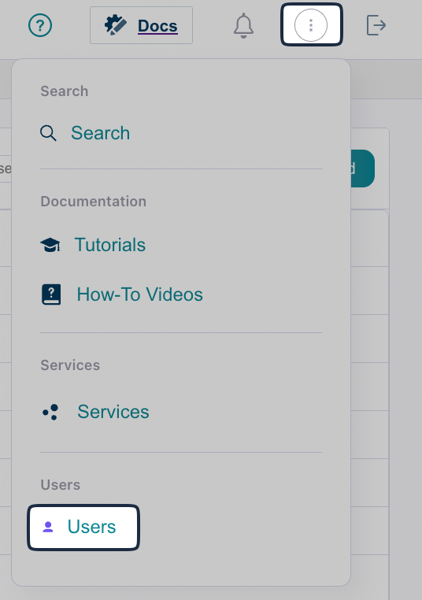

Users in the Administrator role can add other users to a tenant (your DynamicLink account). 

### User roles

| Role | Description |
|------|-------------|
| Administrator | Full permissions across DynamicLink |
| Editor | Full permissions, but cannot add or update other users |
| Viewer | Read-only access | 

### Add a user

From DynamicLink, click the menu in the upper right and selecting **Users**. 

Click **Add** and then complete the following fields:

| Field | Description |
|-------|-------------|
| Username | Enter the username. Usernames cannot include capital letters. |
| Password | Enter a default password for the user.  You must provide this password to the user. When they log in for the first time, they will be prompted to update their password. |
| Role | Select a user role. |
| Email | Enter an email address for the user. |
| First Name | Enter the user's full name. |
| Phone | Enter a phone number for the user (optional). |
| Description | Enter a description for the user (optional). | 

When the user signs in, their username will be a combination of the username you entered above and your organization's tenant ID. 

For example, if you enter `john` as the username and your tenant is `EXAMPLE_1`, John would sign in as `john@EXAMPLE-1`